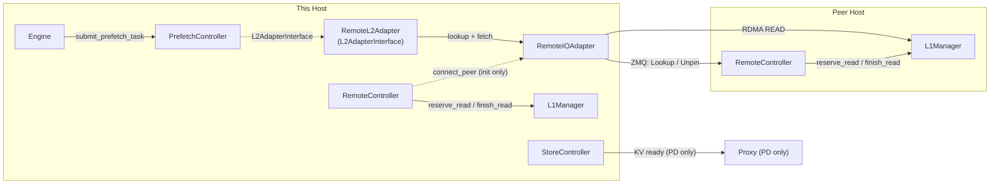

# Design: RemoteController

**Status**: Draft  
**Author**: weishu@tensormesh.ai  
**Date**: 2026-04-16

For implementation details (interfaces, config, file structure, adapter
internals, idempotency) see [remote_controller_impl.md](remote_controller_impl.md).

---

## 1. Goal

Enable direct memory-to-memory transfer of KV-cache tensors between two LMCache
instances over RDMA (or any pluggable transport), without an intermediate storage
layer.  Supports two use cases:

- **P2P** — symmetric cache sharing: either host can prefetch from the other's L1.
- **PD** — Prefill-Decode disaggregation: Prefill stores KV locally, notifies
  the proxy, and Decode pulls it over RDMA on demand.

---

## 2. Component Placement

Each host runs the same set of components.  The `mode` config field determines
which are active.



**`RemoteL2Adapter`** — thin `L2AdapterInterface` wrapper; the single point of
contact between `PrefetchController` and the remote path. Delegates all I/O to
`RemoteIOAdapter`. No internal state beyond `rc` and `rio` references.
Read-only: `submit_store_task` is a no-op. Must not be added to the
`StoreController`'s adapter list (see §6).

**`RemoteIOAdapter`** — client-side I/O, internal to `RemoteL2Adapter`:
- Owns both the **lookup protocol** (ZMQ `LookupRequest / UnpinRequest` fan-out,
  Lazy Pirate resilience, lookup policy) and **RDMA data transfer** (NIXL/UCX).
- Caches per-key remote handles between lookup and fetch phases.
- `NixlIOAdapter` is the concrete implementation.

**`RemoteController`** — server side + peer connection management, internal to `RemoteL2Adapter`:
- ZMQ REP server: handles `LookupRequest / UnpinRequest`, calls `L1Manager.reserve_read / finish_read`
- `register_peer()`: runs Init/MemReg handshake and calls `RemoteIOAdapter.connect_peer()`
- Reconnect thread: polls `rio.get_disconnected_peers()` and retries `register_peer()`
- No client-side lookup fan-out

| Mode | Required | Optional |
|------|----------|---------|
| P2P (both hosts) | `RemoteController` + `RemoteIOAdapter` + `RemoteL2Adapter` + `PrefetchController` | — |
| PD prefill | `RemoteController` + `StoreController` | — |
| PD decode | `RemoteController` + `RemoteIOAdapter` + `RemoteL2Adapter` + `PrefetchController` | — |

---

## 3. Control Protocol Messages

All messages use `msgspec.Struct` with `tag=True`.  Encoded as msgpack.

```
Message                 Direction          Purpose
──────────────────────────────────────────────────────────────────
InitRequest             client → server    Exchange NIXL agent metadata
InitResponse            server → client    ack + server metadata
MemRegRequest           client → server    Exchange NIXL xfer_descs
MemRegResponse          server → client    ack + server xfer_descs
──────────────────────────────────────────────────────────────────
LookupRequest           client → server    Which keys exist in remote L1?
                                           fields: request_id, keys
                                           request_id is stable across retries (see impl §3)
LookupResponse          server → client    bitmap + page_indices per found key
──────────────────────────────────────────────────────────────────
UnpinRequest            client → server    Release read locks for keys
                                           fields: request_id, found_keys
                                           request_id matches the originating LookupRequest
UnpinResponse           server → client    ack
──────────────────────────────────────────────────────────────────
```

`InitRequest / MemRegRequest / Response` are reused verbatim from the existing
`NixlChannel` handshake protocol.  All messages are handled by `RemoteController`
on both the sending and receiving side.  `RemoteTransferAdapter` has no protocol
knowledge and handles no control messages.

> **PD pull reuses P2P messages.** Both flows use `LookupRequest → RDMA READ →
> UnpinRequest`.  There are no PD-specific control messages.

---

## 4. Data Flows

### 4.1 P2P Pull (host_b fetches from host_a)

Single-peer is the degenerate case (N=1); the flow is identical. Diagram shows
`PrefetchController` as the initiator; without it the Engine drives the same
`RemoteController.lookup()` path on L1 miss.

#### Sequence diagram

```mermaid
sequenceDiagram
    participant PC  as PrefetchCtl (b)
    participant L1B as L1Mgr (b)
    participant RLA as RemoteL2Adapter (b)
    participant RIA as RemoteIOAdapter (b)
    participant RCA as RemoteController (a)
    participant L1A as L1Mgr (a)

    PC ->> RLA: submit_lookup_and_lock_task(keys)
    RLA ->> RIA: submit_lookup_task(keys)
    activate RIA
    par fan-out ZMQ LookupRequest to all N peers
        RIA ->> RCA: LookupRequest(request_id, keys)
        RCA ->> L1A: reserve_read(keys)
        L1A -->> RCA: found_keys + pages
        RCA -->> RIA: LookupResponse(found_bitmap, pages)
    end
    Note over RIA: apply lookup_policy; cache handles; build Bitmap; signal lookup_event_fd
    deactivate RIA

    PC ->> RLA: query_lookup_and_lock_result(task_id)
    RLA ->> RIA: query_lookup_result(task_id)
    RIA -->> RLA: Bitmap
    RLA -->> PC: Bitmap (found keys)

    PC ->> L1B: reserve_write(found_keys, is_temporary, layout, mode=new)
    L1B -->> PC: write_bitmap + local_objs

    PC ->> RLA: submit_load_task(found_keys, local_objs)
    RLA ->> RIA: submit_fetch_task(found_keys, local_objs)
    activate RIA
    Note over RIA: use cached handles; issue RDMA READs
    par RDMA READ per key
        RIA ->> L1A: RDMA READ
        L1A -->> RIA: RDMA DONE
    end
    Note over RIA: build result Bitmap; signal fetch_event_fd
    deactivate RIA

    PC ->> RLA: query_load_result(task_id)
    RLA ->> RIA: query_fetch_result(task_id)
    RIA -->> RLA: Bitmap
    RLA -->> PC: Bitmap (loaded keys)

    alt loaded_keys
        PC ->> L1B: finish_write_and_reserve_read(loaded_keys)
    else load_failed_keys
        PC ->> L1B: finish_write(load_failed_keys)
        PC ->> L1B: delete(load_failed_keys)
    end

    PC ->> RLA: submit_unlock(found_keys)
    RLA ->> RIA: submit_unlock(found_keys)
    par ZMQ UnpinRequest per peer
        RIA ->> RCA: UnpinRequest(request_id, peer_found_keys)
        Note over RCA: finish_read; evict dedup entry
    end
```

### 4.2 PD Pull (decode pulls from prefill via RemoteTransferAdapter)

Prefill stores KV in its own L1, notifies the proxy, and serves RDMA READs.
Decode pulls KV on demand — the same `LookupRequest → RDMA READ → UnpinRequest`
path as P2P pull.

For multi-peer routing (round_robin / broadcast) see
[remote_controller_impl.md §2](remote_controller_impl.md).

#### Sequence diagram

```mermaid
sequenceDiagram
    participant PRX as Proxy
    participant SCP as StoreCtl (prefill)
    participant L1P as L1Mgr (prefill)
    participant RCP as RemoteController (prefill)
    participant ENG as Engine (decode)
    participant PC  as PrefetchCtl (decode)
    participant RLA as RemoteL2Adapter (decode)
    participant RIA as RemoteIOAdapter (decode)
    participant L1D as L1Mgr (decode)

    PRX ->> SCP: dispatch prefill request
    activate SCP
    Note over SCP,L1P: prefill computes KV, stores in local L1
    L1P ->> SCP: on_write_finished(keys)
    SCP ->> PRX: KV ready (request_id, keys)
    deactivate SCP

    PRX ->> ENG: forward request + key list (request_id, keys)
    ENG ->> PC: submit_prefetch_task(keys, layout)

    activate PC
    PC ->> RLA: submit_lookup_and_lock_task(keys)
    RLA ->> RIA: submit_lookup_task(keys)
    activate RIA
    RIA ->> RCP: ZMQ LookupRequest(request_id, keys)
    activate RCP
    RCP ->> L1P: reserve_read(keys)
    L1P -->> RCP: found_keys + pages
    RCP ->> RCP: dedup cache: store request_id
    RCP -->> RIA: LookupResponse(found_bitmap, pages_per_found)
    deactivate RCP
    Note over RIA: cache handles; build Bitmap; signal lookup_event_fd
    deactivate RIA

    PC ->> L1D: reserve_write(found_keys, is_temporary=False, layout, mode=new)
    L1D -->> PC: write_bitmap + local_objs

    PC ->> RLA: submit_load_task(found_keys, local_objs)
    RLA ->> RIA: submit_fetch_task(found_keys, local_objs)
    activate RIA
    Note over RIA: use cached handles; issue RDMA READs
    RIA ->> L1P: RDMA READ
    L1P -->> RIA: RDMA DONE
    Note over RIA: build result Bitmap; signal fetch_event_fd
    deactivate RIA

    alt loaded_keys
        PC ->> L1D: finish_write_and_reserve_read(loaded_keys)
    else load_failed_keys
        PC ->> L1D: finish_write(load_failed_keys)
        PC ->> L1D: delete(load_failed_keys)
    end

    PC -->> ENG: prefetch complete (hit_count)
    deactivate PC

    ENG ->> L1D: read_prefetched_results(loaded_keys)

    PC ->> RLA: submit_unlock(found_keys)
    RLA ->> RIA: submit_unlock(found_keys)
    RIA ->> RCP: ZMQ UnpinRequest(request_id, found_keys)
    activate RCP
    RCP ->> L1P: finish_read(found_keys)
    RCP ->> RCP: dedup cache: evict request_id
    deactivate RCP

    ENG ->> L1D: finish_read(loaded_keys)
```

