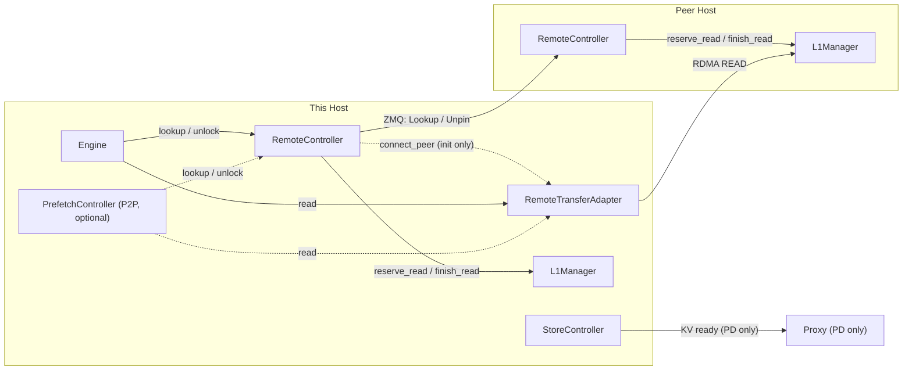
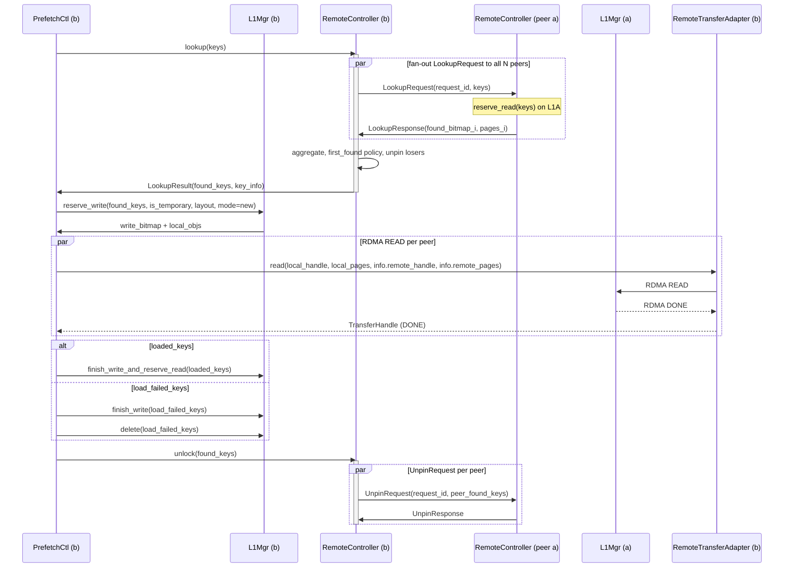
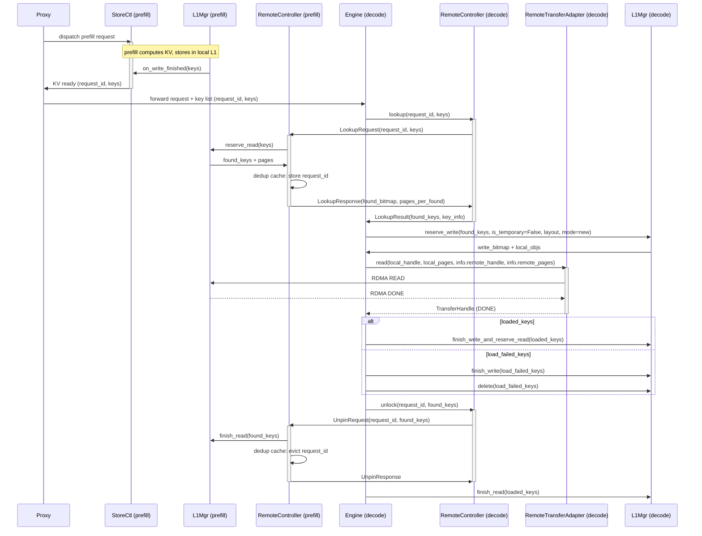

# Design: RemoteController

**Status**: Draft  
**Author**: weishu@tensormesh.ai  
**Date**: 2026-04-16

For implementation details (interfaces, config, file structure, adapter
internals, idempotency) see [remote_controller_impl.md](remote_controller_impl.md).

---

## 1. Goal

Enable direct memory-to-memory transfer of KV-cache tensors between two LMCache
instances over RDMA (or any pluggable transport), without an intermediate storage
layer.  Supports two use cases:

- **P2P** — symmetric cache sharing: either host can prefetch from the other's L1.
- **PD** — Prefill-Decode disaggregation: Prefill stores KV locally, notifies
  the proxy, and Decode pulls it over RDMA on demand.

---

## 2. Component Placement

Each host runs the same set of components.  The `mode` config field determines
which are active.



**`RemoteController`** — all control-plane and peer coordination:
- Peer registry: ZMQ channels per peer, remote memory handles, connection lifecycle
- Metadata exchange: `InitRequest / MemRegRequest` handshake at startup
- Lookup: sends `LookupRequest` to peers, applies lookup policy, manages dedup cache
- Server side: handles incoming `LookupRequest / UnpinRequest`, calls `L1Manager.reserve_read / finish_read`

**`RemoteTransferAdapter`** — data-plane transport, no protocol knowledge:
- `NixlTransferBackend` — RDMA READ/WRITE over UCX (InfiniBand / RoCE)
- Interface: `read/write(local_handle, local_pages, remote_handle, remote_pages)`

| Mode | Required | Optional |
|------|----------|---------|
| P2P (both hosts) | `RemoteController` + `RemoteTransferAdapter` | `PrefetchController` (speculative prefetch) |
| PD prefill | `RemoteController` + `StoreController` | — |
| PD decode | `RemoteController` + `RemoteTransferAdapter` | — |

---

## 3. Control Protocol Messages

All messages use `msgspec.Struct` with `tag=True`.  Encoded as msgpack.

```
Message                 Direction          Purpose
──────────────────────────────────────────────────────────────────
InitRequest             client → server    Exchange NIXL agent metadata
InitResponse            server → client    ack + server metadata
MemRegRequest           client → server    Exchange NIXL xfer_descs
MemRegResponse          server → client    ack + server xfer_descs
──────────────────────────────────────────────────────────────────
LookupRequest           client → server    Which keys exist in remote L1?
                                           fields: request_id, keys
                                           request_id is stable across retries (see impl §3)
LookupResponse          server → client    bitmap + page_indices per found key
──────────────────────────────────────────────────────────────────
UnpinRequest            client → server    Release read locks for keys
                                           fields: request_id, found_keys
                                           request_id matches the originating LookupRequest
UnpinResponse           server → client    ack
──────────────────────────────────────────────────────────────────
```

`InitRequest / MemRegRequest / Response` are reused verbatim from the existing
`NixlChannel` handshake protocol.  All messages are handled by `RemoteController`
on both the sending and receiving side.  `RemoteTransferAdapter` has no protocol
knowledge and handles no control messages.

> **PD pull reuses P2P messages.** Both flows use `LookupRequest → RDMA READ →
> UnpinRequest`.  There are no PD-specific control messages.

---

## 4. Data Flows

### 4.1 P2P Pull (host_b fetches from host_a)

Single-peer is the degenerate case (N=1); the flow is identical. Diagram shows
`PrefetchController` as the initiator; without it the Engine drives the same
`RemoteController.lookup()` path on L1 miss.

#### Sequence diagram



> **Implementation note (PrefetchController async path).** The sequence above
> shows the logical flow. In practice, `PrefetchController` never calls
> `rc.lookup()` directly on its background thread. Instead, the full remote
> pipeline (`lookup → reserve_write → rta.read → poll → unlock`) runs in a
> thread-pool task and signals `_remote_efd` on completion. The background loop
> picks up the result via `_process_remote_completions()`, keeping the loop
> non-blocking even if a peer is slow or disconnected. See
> [remote_controller_impl.md §6.1](remote_controller_impl.md).

### 4.2 PD Pull (decode pulls from prefill via RemoteTransferAdapter)

Prefill stores KV in its own L1, notifies the proxy, and serves RDMA READs.
Decode pulls KV on demand — the same `LookupRequest → RDMA READ → UnpinRequest`
path as P2P pull.

For multi-peer routing (round_robin / broadcast) see
[remote_controller_impl.md §2](remote_controller_impl.md).

#### Sequence diagram



