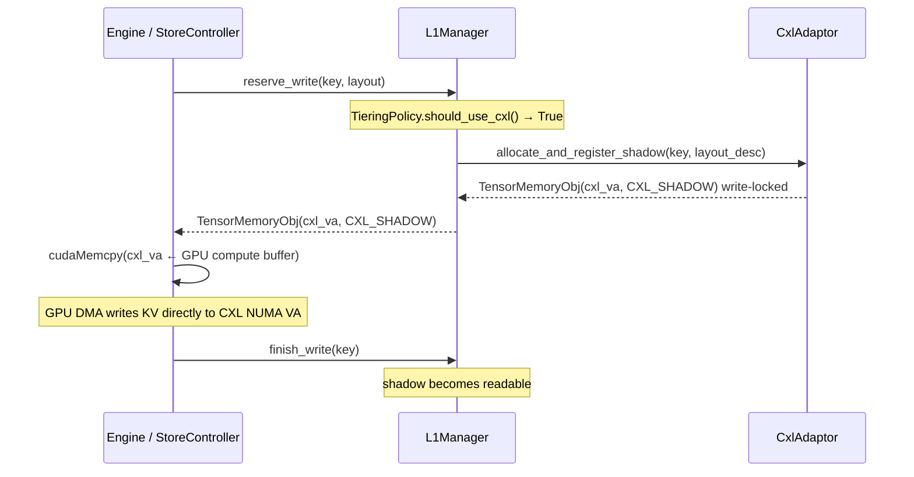
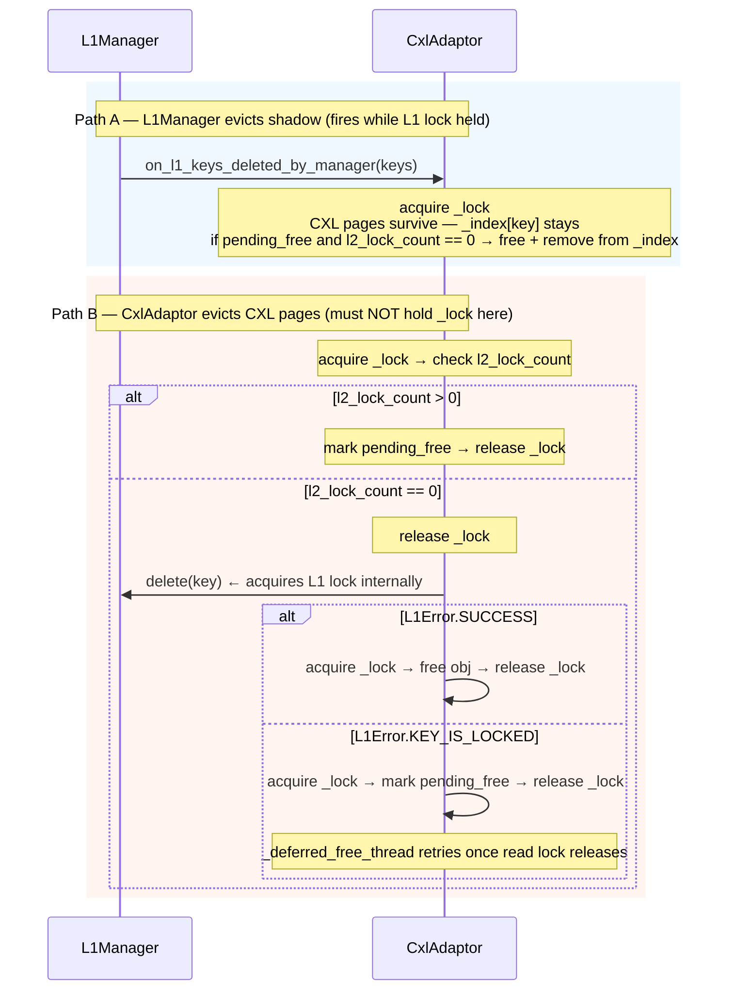

# Design: CXL Adaptor

**Status**: Draft
**Author**: weishu@tensormesh.ai
**Date**: 2026-04-23

Companion to [cxl_adaptor_impl.md](cxl_adaptor_impl.md) (implementation details).

---

## 1. Overview

CXL support adds two independent L2 adapters to `StorageManager`:

| Adapter | Registered as | Coverage |
|---|---|---|
| `CxlAdaptor` | L2 adapter | Local CXL NUMA region on this host |
| `CxlRemoteL2Adapter` | L2 adapter | Remote peers' CXL regions (via ZMQ + memcpy) |

`PrefetchController` queries both adapters in parallel using the standard
multi-adapter fan-out already in place.  A key found locally is never
fetched remotely — the existing `PrefetchPolicy` selects the winning adapter
per key before issuing loads.

### CXL region setup

Each host maps its CXL sub-region at startup via the Linux DAX device interface and
wraps it as a `torch.Tensor` so `TensorMemoryAllocator` can manage suballocations:

```python
# 1. Map the CXL sub-region from the DAX device.
fd = os.open(config.dax_device_path, os.O_RDWR)
_mmap = mmap.mmap(fd, config.region_size, flags=mmap.MAP_SHARED,
                  prot=mmap.PROT_READ | mmap.PROT_WRITE)
_region_va_base = ctypes.addressof(ctypes.c_char.from_buffer(_mmap))

# 2. Wrap as a tensor so TensorMemoryAllocator can suballocate within it.
_buf = (ctypes.c_uint8 * config.region_size).from_address(_region_va_base)
_cxl_tensor = torch.frombuffer(_buf, dtype=torch.uint8)
_allocator = TensorMemoryAllocator(_cxl_tensor, align_bytes=config.align_bytes)

# 3. Register with CUDA so the GPU can DMA directly to/from CXL addresses.
cudaHostRegister(_region_va_base, config.region_size, cudaHostRegisterDefault)
```

`cudaHostRegister` is called once per region at startup.
`cudaHostUnregister`, `_mmap.close()`, and `os.close(fd)` run in `close()`.

### Components

| Component | Interface | Role |
|---|---|---|
| `CxlAdaptor` | `L1ManagerListener` + `L2AdapterInterface` | Local CXL: allocation, shadow registration, GPU transfer, local L2 lookup/load/store |
| `CxlRemoteController` | — | ZMQ server: lookup requests from remote clients against local `CxlAdaptor._index` |
| `CxlRemoteL2Adapter` | `L2AdapterInterface` (+ optionally `L1ManagerListener`) | Client-side: ZMQ lookup fan-out to peers, peer DAX window access, peer lifecycle. Two access modes: DRAM-bounce and GPU-direct. |

`CxlRemoteL2Adapter` implements `L2AdapterInterface` directly — there is no
separate IO adapter layer.  Unlike the NIXL split (`RemoteIOAdapter` +
`RemoteL2Adapter`), the CXL client has no RDMA memory registration or
multi-step descriptor exchange, so the two-class separation adds no value.
`CxlRemoteController` holds a concrete `CxlRemoteL2Adapter` reference and
calls peer lifecycle methods (`connect_peer`, `disconnect_peer`,
`get_disconnected_peers`) on it directly.

`CxlRemoteL2Adapter` supports two access modes selected at construction time:

| Mode | `requires_pre_allocation` | Data path | When to use |
|---|---|---|---|
| `dram_bounce` (default) | `True` | peer CXL → local DRAM → GPU | Conservative; always correct |
| `gpu_direct` | `False` | peer CXL → GPU directly (no DRAM copy) | CXL fabric supports `cudaHostRegister` on peer DAX window |

**Control plane** (`CxlRemoteController`) is modelled after `ZMQRemoteController`
but queries `CxlAdaptor._index` instead of `L1Manager`.

---

## 2. Shadow Page Model

CXL objects are registered as **shadow pages** in `L1Manager`: metadata (locks, TTL,
layout) lives in `L1Manager`; tensor data stays in CXL NUMA memory.

```
L1Manager._objects                       CxlAdaptor._index
  key → L1ObjectState(                     key → CxlIndexEntry(
    TensorMemoryObj(cxl_va, CXL_SHADOW))         obj:           TensorMemoryObj
    write_lock, read_lock                         pending_free:  bool
                                                  l2_lock_count: int)
                                               ↑ authoritative CXL allocation + layout
```

`l2_lock_count` guards against CXL-side eviction while the object is in use by
either the local `PrefetchController` or a remote peer reading via
`CxlRemoteL2Adapter`.  Both increment/decrement the same counter.

### Benefits

- **Unified lookup** — `reserve_read` returns both DRAM and CXL objects transparently.
- **Direct CXL↔GPU transfer** — consumer calls `transfer_to_gpu`; no DRAM bounce.
- **No DRAM budget impact** — `L1MemoryManager` never allocates for shadow pages.

### Two-Index Consistency

| Event | Owner | Action |
|---|---|---|
| L1Manager evicts a shadow | `CxlAdaptor` (listener) | no-op — CXL pages survive; `_index` entry stays; shadow re-registered on next lookup |
| CxlAdaptor evicts CXL pages | `CxlAdaptor` | call `l1_manager.delete(key)` **before** freeing pages |

---

## 3. `requires_pre_allocation` Extension

`L2AdapterInterface` gains one new method with a default of `True`:

```python
def requires_pre_allocation(self) -> bool:
    """Whether PrefetchController should call L1Manager.reserve_write before
    submit_load_task.

    Default True for all existing adapters (no change).  CxlAdaptor returns
    False because it re-registers an existing CXL_SHADOW object in L1Manager
    during load — no DRAM buffer is needed and none must be passed."""
    return True
```

`PrefetchController._transition_to_load_phase` is updated to check this flag
per adapter and only reserve L1 write buffers for adapters that need them.
Adapters returning `False` receive `objects=[]` in `submit_load_task`.

`CxlRemoteL2Adapter` returns `True` in `dram_bounce` mode (remote data lands in
a pre-allocated DRAM buffer via `memcpy`) and `False` in `gpu_direct` mode
(adapter registers a `REMOTE_CXL_SHADOW` object in `L1Manager` so the GPU can
DMA directly from the peer DAX window VA).

---

## 4. Data Flows

### 4.1 Write (GPU writes KV directly to CXL)

`L1Manager.reserve_write` has a new `TieringPolicy` hook: when
`TieringPolicy.should_use_cxl()` returns `True`, it calls
`CxlAdaptor.allocate_and_register_shadow` instead of the normal DRAM path.



### 4.2 Local CXL Read (PrefetchController → CxlAdaptor)

`CxlAdaptor.requires_pre_allocation()` returns `False`.
`PrefetchController` skips `reserve_write` and passes `objects=[]` to
`submit_load_task`.

```mermaid
sequenceDiagram
    participant PC  as PrefetchController
    participant CXL as CxlAdaptor
    participant L1  as L1Manager
    participant GPU as GPU

    PC  ->> CXL: submit_lookup_and_lock_task(keys)
    Note over CXL: check _index; increment l2_lock_count for found keys
    CXL -->> PC: task_id
    Note over PC: query_lookup_and_lock_result → found_bitmap

    Note over PC: requires_pre_allocation() = False → skip reserve_write

    PC  ->> CXL: submit_load_task(found_keys, objects=[])
    CXL ->> L1:  reregister_shadow(key) write-locked  [no data copy]
    CXL -->> PC: task_id

    PC  ->> L1:  finish_write_and_reserve_read(keys)
    L1 -->> PC:  TensorMemoryObj(cxl_va, CXL_SHADOW) read-locked

    Note over PC: Engine / consumer calls CxlAdaptor.transfer_to_gpu(obj, gpu_dst)
    PC  ->> CXL: transfer_to_gpu(obj, gpu_dst)
    Note over CXL: async cudaMemcpy(gpu_dst ← cxl_va) via ThreadPoolExecutor
    CXL -->> PC: Future; engine awaits completion
    Note over GPU: GPU DMA reads directly from CXL NUMA VA

    PC  ->> CXL: submit_unlock(keys, lookup_task_id)
    Note over CXL: decrement l2_lock_count; free if pending_free
```

### 4.3 Remote CXL Read — Variant A: DRAM bounce (`dram_bounce` mode)

`requires_pre_allocation()` returns `True`.  `PrefetchController` pre-allocates
local DRAM buffers.  Data flows: peer CXL NUMA → local DRAM via CPU `memcpy`,
then GPU reads from DRAM.  Remote `l2_lock_count` is released as soon as
`memcpy` finishes — the peer can evict safely at that point.

```mermaid
sequenceDiagram
    participant PC  as PrefetchController (local)
    participant RL2 as CxlRemoteL2Adapter (local)
    participant RC  as CxlRemoteController (peer)
    participant CXL as CxlAdaptor (peer)
    participant WIN as Peer DAX Window (local mmap)

    PC  ->> RL2: submit_lookup_and_lock_task(keys)
    Note over RL2: fan-out ZMQ CxlLookupRequest to all peers (background)
    RL2 ->> RC:  CxlLookupRequest(request_id, keys)
    RC  ->> CXL: server_lookup_and_lock(keys)
    Note over CXL: check _index; increment l2_lock_count; return byte_offsets
    RC -->> RL2: CxlLookupResponse(found_positions, byte_offsets, byte_sizes)
    Note over RL2: cache CxlRemoteHandle per key; signal lookup_and_lock_efd

    Note over PC: requires_pre_allocation() = True → reserve_write(found_keys)

    PC  ->> RL2: submit_load_task(found_keys, dram_objs, lookup_task_id)
    Note over RL2: peer_va = WIN.va_base + byte_offset<br/>memcpy(dram_obj.ptr ← peer_va, byte_size) per key
    RL2 ->> WIN: parallel memcpy (ThreadPoolExecutor)
    Note over RL2: signal load_efd on completion

    PC  ->> L1:  finish_write_and_reserve_read(loaded_keys)

    PC  ->> RL2: submit_unlock(keys, lookup_task_id)
    Note over RL2: data already in DRAM — safe to unpin immediately
    RL2 ->> RC:  CxlUnpinRequest(request_id, found_keys)
    RC  ->> CXL: server_unpin(keys)
    Note over CXL: decrement l2_lock_count; free if pending_free
```

### 4.4 Remote CXL Read — Variant B: GPU-direct (`gpu_direct` mode)

`requires_pre_allocation()` returns `False`.  `PrefetchController` skips
`reserve_write`.  `submit_load_task` registers a `REMOTE_CXL_SHADOW` object in
`L1Manager` whose `data_ptr()` points directly into the peer DAX window VA
(`peer_region.va_base + byte_offset`).  The GPU DMA reads from that address
over the CXL fabric — no local DRAM copy.

The peer's `l2_lock_count` must stay > 0 until the GPU DMA completes (not just
until the load task signals done).  `CxlRemoteL2Adapter` implements
`L1ManagerListener`: `submit_unlock` is a no-op; the actual `CxlUnpinRequest`
fires in `on_l1_keys_read_finished`, which is called when the engine releases
its L1 read lock after GPU DMA completes.

```mermaid
sequenceDiagram
    participant PC  as PrefetchController (local)
    participant RL2 as CxlRemoteL2Adapter (local)
    participant L1  as L1Manager (local)
    participant RC  as CxlRemoteController (peer)
    participant CXL as CxlAdaptor (peer)
    participant WIN as Peer DAX Window (cudaHostRegistered mmap)
    participant GPU as GPU

    PC  ->> RL2: submit_lookup_and_lock_task(keys)
    RL2 ->> RC:  CxlLookupRequest(request_id, keys)
    RC  ->> CXL: server_lookup_and_lock(keys)
    Note over CXL: increment l2_lock_count; return byte_offsets
    RC -->> RL2: CxlLookupResponse(found_positions, byte_offsets, byte_sizes)

    Note over PC: requires_pre_allocation() = False → skip reserve_write

    PC  ->> RL2: submit_load_task(found_keys, objects=[], lookup_task_id)
    Note over RL2: peer_va = WIN.va_base + byte_offset<br/>create TensorMemoryObj(peer_va, REMOTE_CXL_SHADOW)<br/>store key→handle in _pending_remote_unpin
    RL2 ->> L1:  register_shadow(key, remote_shadow_obj) write-locked
    Note over RL2: signal load_efd immediately (no copy needed)

    PC  ->> L1:  finish_write_and_reserve_read(loaded_keys)
    Note over L1: shadow transitions write-locked → read-locked

    PC  ->> RL2: submit_unlock(keys, lookup_task_id)
    Note over RL2: gpu_direct mode — no-op<br/>remote lock held until GPU done

    Note over PC: engine reads prefetched results
    PC  ->> GPU: cudaMemcpy(gpu_dst ← remote_shadow_obj.data_ptr())
    Note over GPU: GPU DMA reads directly from peer CXL NUMA VA

    Note over PC: engine calls finish_read_prefetched → L1.finish_read
    L1  ->> RL2: on_l1_keys_read_finished(keys)  [L1ManagerListener callback]
    Note over RL2: read from _pending_remote_unpin; send deferred CxlUnpinRequest
    RL2 ->> RC:  CxlUnpinRequest(request_id, found_keys)
    RC  ->> CXL: server_unpin(keys)
    Note over CXL: decrement l2_lock_count; free if pending_free
```

### 4.5 Eviction Consistency

CXL-side eviction must not free pages while `l2_lock_count > 0`.

Lock ordering rule: **always acquire `L1Manager._lock` before `CxlAdaptor._lock`**.



---

## 5. Remote CXL Protocol

Modelled after the RDMA `ZMQRemoteController` protocol with two simplifications:
no `MemRegRequest/Response` step (byte offsets replace NIXL page handles), and
the server queries `CxlAdaptor._index` (not `L1Manager`).

### Socket layout

```
REP socket  (serve_port):      CxlInitRequest/Response, CxlLookupRequest/Response
PULL socket (serve_unpin_port): CxlUnpinRequest (no reply)
```

### Messages

```python
class CxlRegionMeta(msgspec.Struct):
    dax_device_path: str  # DAX device path peers use to mmap this host's window
    region_size:     int  # bytes
    align_bytes:     int  # allocation alignment (informational)

class CxlInitRequest(msgspec.Struct, tag=True):
    local_region_meta: CxlRegionMeta

class CxlInitResponse(msgspec.Struct, tag=True):
    server_region_meta: CxlRegionMeta

class CxlLookupRequest(msgspec.Struct, tag=True):
    request_id: str            # stable across retries; server dedup key
    keys: list[WireObjectKey]  # reuse WireObjectKey from remote_controller/protocol.py

class CxlLookupResponse(msgspec.Struct, tag=True):
    found_positions: list[int]  # indices into original keys list
    byte_offsets:    list[int]  # offset within peer CXL region per found key
    byte_sizes:      list[int]  # object size in bytes per found key

class CxlUnpinRequest(msgspec.Struct, tag=True):
    request_id: str
    found_keys: list[WireObjectKey]
```

### Handshake sequence

```
1. Client → CxlInitRequest { local_region_meta }
2. Server → CxlInitResponse { server_region_meta }
   (client mmaps server's DAX device at server_region_meta.dax_device_path)
```

No `MemReg` round-trip is needed.

### Server-side dedup

Identical to `ZMQRemoteController`: responses are cached by `request_id` for
`remote_pin_ttl_s + 10` seconds.  `CxlUnpinRequest` clears the entry and calls
`CxlAdaptor.server_unpin()`.

### Peer address formula

```python
byte_offset = obj.data_ptr() - _region_va_base   # computed on server
byte_size   = obj.phy_size

peer_va     = peer_region.va_base + byte_offset   # computed on client
```

---

## 6. `CxlAdaptor` Server-Side Methods

Two synchronous methods called by `CxlRemoteController` in the ZMQ server thread:

```python
def server_lookup_and_lock(
    self,
    keys: list[ObjectKey],
) -> dict[ObjectKey, tuple[int, int]]:
    """Synchronously look up keys in _index, increment l2_lock_count.

    Called by CxlRemoteController._handle_lookup() in the ZMQ server thread.
    Does NOT interact with L1Manager — reads only from _index.

    Args:
        keys: Keys to look up.

    Returns:
        {key: (byte_offset, byte_size)} for found keys only.
    """

def server_unpin(self, keys: list[ObjectKey]) -> None:
    """Decrement l2_lock_count for each key; free if pending_free.

    Called by CxlRemoteController._handle_unpin() in the ZMQ server thread.

    Args:
        keys: Keys whose remote read locks should be released.
    """
```

These are distinct from the async `L2AdapterInterface` methods
(`submit_lookup_and_lock_task` / `submit_unlock`) used by the local
`PrefetchController`.  The same `l2_lock_count` counter is shared — all
callers (local and remote) increment/decrement under `_lock`.

---

## 7. Integration Summary

| Component | Change | Notes |
|---|---|---|
| `MemoryFormat` | Add `CXL_SHADOW`, `REMOTE_CXL_SHADOW` | Tags on `TensorMemoryObj.meta.fmt`; both skipped by `L1MemoryManager.free()` |
| `L1Manager` | Add `register_shadow()` (accepts `CXL_SHADOW` + `REMOTE_CXL_SHADOW`) + TieringPolicy branch in `reserve_write` | ~40 lines |
| `L1MemoryManager.free()` | Skip `CXL_SHADOW` and `REMOTE_CXL_SHADOW` objects | Each adapter owns its own memory; L1 must not free it |
| `L2AdapterInterface` | Add `requires_pre_allocation() → bool` (default `True`) | Non-breaking; existing adapters unchanged |
| `PrefetchController` | Check `requires_pre_allocation()` per adapter in `_transition_to_load_phase` | Skip `reserve_write` + pass `objects=[]` for `False` adapters |
| `CxlAdaptor` | New file; registered as `L1ManagerListener` by `StorageManager` | Local CXL L2 adapter + server-side index methods + LRU eviction |
| `CxlRemoteController` | New file | ZMQ server; queries `CxlAdaptor` |
| `CxlRemoteL2Adapter` | New file; registered as `L1ManagerListener` in `gpu_direct` mode by `StorageManager`; `l1_manager` injected at construction | Client-side `L2AdapterInterface`: ZMQ lookup fan-out, peer DAX access, peer lifecycle, two access modes |
| `StorageManager` | Wire up `CxlAdaptor` + `CxlRemoteL2Adapter`; inject `l1_manager`; register listeners | See `cxl_adaptor_impl.md` §7 for construction snippet |
| Engine / consumer | Detect `CXL_SHADOW`, call `CxlAdaptor.transfer_to_gpu(obj, gpu_dst)` | Single dispatch point; returns a `Future` |
| `RemoteController` / `StoreController` | **unchanged** | Format-agnostic |

See [cxl_adaptor_impl.md](cxl_adaptor_impl.md) for full interface definitions
and file structure.
